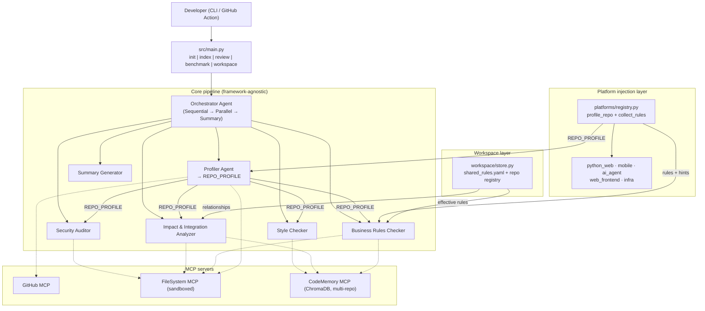
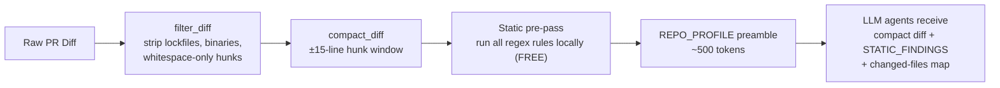

# CodeReviewBot 🔍

**Multi-Agent PR Review & Security Audit Agent with Code Memory, Platform Adapters, and a Cross-Repo Workspace Layer.**

CodeReviewBot is a repository-aware automated code review tool built on the **Google Agent Development Kit (ADK)** and the **Model Context Protocol (MCP)**. It profiles a repository's stack, injects framework-specific rules through a platform-adapter registry, enforces project-specific business rules (shared across a product's repos), calculates blast radius, verifies third-party packages, and scans for security exploits — all behind a token-budgeted pipeline.

It supports **mobile (iOS / Android / Flutter / React Native)**, **Python web (Django / Flask / FastAPI / Zango)**, **AI-agent repos (ADK / LangGraph / CrewAI / MCP)**, **web frontends**, and **infra (Terraform / Docker / K8s)** out of the box — and new stacks can be added by registering a new adapter, without touching the core agents.

---

## 🚀 Key Features

* **Repo Profiling** — Auto-detects languages, frameworks, cloud providers, integration layers (cache, db, queue), and architecture before any review runs.
* **Platform Adapter Registry** — Stack-specific rules and hints are *injected* via `src/platforms/`. Core agents stay framework-agnostic. Adding a new framework = one new adapter module + a registry entry.
* **3-Tier Business Rules** — Auto-discovered patterns (CodeMemory) → config-defined (`rules.yaml`) → inline annotations (`# crb:ignore` / `# crb:rule`). Higher tiers override lower.
* **Workspace Layer** — Manage shared rules, a repo registry, and upstream/downstream relationships across a product's multiple repositories. Rules are merged: `shared_rules.yaml` + repo `rules.yaml` + platform rules.
* **Multi-Repo Code Memory** — ChromaDB vector store tags every chunk with `repo_id`, enabling cross-repo semantic search, reference lookup, and contract-break detection.
* **Active Defense Registry Check** — Queries public NPM and PyPI registries to flag hallucinated dependencies or typo-squatting risks.
* **Integration Layer Impact Analysis** — Audits SQL injection / N+1 loops, Redis cache-key drift, and queue schema changes.
* **Token Budgeting** — `compact_diff` trims large diffs to a hunk window; `should_skip_file` filters lockfiles, binaries, and minified assets; review preamble summarizes the `REPO_PROFILE` in ~500 tokens instead of re-describing the stack to every agent.
* **Golden Benchmark Scorecard** — A golden set of 13 repos with ground-truth findings measures precision / recall / F1 so adapter or prompt changes are regression-tested.
* **Sandboxed Environment** — File operations are sandboxed inside the FileSystem MCP server boundary; path traversal is blocked.

---

## 🛠 Tech Stack

| Component | Technology |
|---|---|
| Agent framework | Google Agent Development Kit (`google-adk`) |
| Protocol | Model Context Protocol (MCP) via FastMCP |
| Vector database | ChromaDB (local, persistent) |
| Language | Python 3.10+ |
| CLI | Click |
| Containerization | Docker & Docker Compose |

---

## 🏗 Architecture



### Core + Platform Adapter boundary

| Layer | Owns | Files |
|---|---|---|
| **Core pipeline** | Orchestration, MCP, agents, report schema | `orchestrator.py`, `mcp_servers/`, `agents/` |
| **Platform injection** | Stack-specific default rules, detection, language parsing | `platforms/`, `rule_harvester.py`, `code_chunker.py`, `profiler_agent.py` |
| **Workspace layer** | Shared rules, repo registry, cross-repo relationships | `workspace/store.py` |
| **Portable skills** | Cross-stack review instructions | `.agents/skills/*/SKILL.md` |

To add a **new framework** (e.g. Rust, Elixir): add a `PlatformAdapter` in `src/platforms/<name>.py`, register it in `registry.py`, extend `code_chunker.py`'s `lang_map`. **Core agents are unchanged.**

---

## 🧩 Agent = Model + Harness

Following the Day 1 framing — *the model is the engine, the harness is everything around it that makes it a real agent* — CodeReviewBot wraps Gemini in a deliberate harness, not a bare prompt. Most agent failures are harness failures, so the harness is treated as a first-class deliverable.

| Harness layer | Component | Files |
|---|---|---|
| **Tools** | 3 custom MCP servers (GitHub, FileSystem, CodeMemory) exposed via FastMCP — the "USB-C for AI" pattern from Day 2 | `src/mcp_servers/` |
| **Sandbox** | FileSystem MCP blocks path traversal (`../../etc/passwd`) and absolute paths outside the workspace root | `src/mcp_servers/filesystem_mcp_server.py` (`_get_safe_path`) |
| **Memory** | ChromaDB-backed CodeMemory with per-repo index manifest (`last_indexed_sha` + `file_hashes`) for diff-aware incremental refresh | `src/memory/` |
| **Guardrails (input)** | Multi-stage token budget: `filter_diff` → `compact_diff` → static pre-pass → `REPO_PROFILE` preamble; caps on `n_results`, `max_results`, `max_edges` | `src/utils/token_budget.py`, `src/utils/static_analysis.py` |
| **Guardrails (output)** | Hallucinated-package blocking (live PyPI/npm registry verification) before any finding is reported | `src/utils/package_validator.py` |
| **Skills (procedural memory)** | 5 portable `SKILL.md` files loaded on demand — only the relevant skill is injected per agent, avoiding token rot | `.agents/skills/*/SKILL.md` |
| **Orchestration** | ADK `SequentialAgent` → `ParallelAgent` → `SequentialAgent` topology routes the `REPO_PROFILE` and compact diff to specialist agents in parallel | `src/agents/orchestrator.py` |

The raw Gemini model is interchangeable; the harness is what makes the agent production-grade.

---

## 🪝 Portable Skills

Each skill is a single `SKILL.md` file with YAML frontmatter (`name` / `description`) plus `## Instructions` and `## Output Format` sections — model-agnostic and agent-agnostic (compatible with Gemini CLI, Claude Code, Codex, Antigravity, or any compliant agent, per Day 3's portability principle). They are loaded on demand so the context window is not pre-polluted.

| Skill | File | Trigger | What it tells the agent to do |
|---|---|---|---|
| `security-audit` | `.agents/skills/security-audit/SKILL.md` | Security Auditor agent | Scan for secrets, call `verify_package_exists` for new imports, check SQLi / XSS / command injection; emit `🔒 SECURITY FINDINGS` |
| `style-check` | `.agents/skills/style-check/SKILL.md` | Style Checker agent | Pull `get_style_profile` + `search_similar_code` to enforce the dominant naming convention and docstring/error-handling patterns; emit `🎨 STYLE FINDINGS` |
| `impact-analysis` | `.agents/skills/impact-analysis/SKILL.md` | Impact & Integration Analyzer agent | Use `find_references` + `get_dependency_graph` to map blast radius across Cache / Queue / Database / API layers; emit `💥 IMPACT & INTEGRATION FINDINGS` |
| `business-rules` | `.agents/skills/business-rules/SKILL.md` | Business Rules Checker agent | Parse `rules.yaml`, honor `# crb:ignore` / `# crb:rule` annotations, use `get_pattern_frequency` to propose auto-discovered rules; emit `📏 BUSINESS RULES FINDINGS` |
| `review-summary` | `.agents/skills/review-summary/SKILL.md` | Summary Generator agent | Roll up findings into a single report with HIGH/MEDIUM/LOW risk rating; emit the consolidated `🔍 CodeReviewBot Report` |

### Skill Harvesting

Following the Day 3 "assisted authoring from traces" pattern, observed conventions can be promoted into durable `rules.yaml` procedural memory:

```bash
# Surface dominant style conventions (≥80% threshold) as candidate rules
codereviewbot harvest-rules --path <repo>
codereviewbot harvest-rules --path <repo> --apply     # persist all suggestions

# Approve a single rule with a valid regex
codereviewbot approve-rule --id no-float-for-money \
    --pattern 'float\s*\(' --description "Do not use float for money" \
    --severity high --files "**/billing*.py"
```

Approved rules run in the **local static pre-pass** on every future review — no LLM call is required to enforce them.

---

## 📂 Project Structure

```
<workspace-root>/                       # Workspace root (run workspace commands from here)
├── .crb-workspace/                    # LOCAL ONLY (gitignored) — see examples/workspace/
│   ├── workspace.yaml                 # Your repo registry (copy from example or workspace init)
│   ├── shared_rules.yaml              # Your product-wide rules
│   └── chroma_db/                     # Multi-repo vector store (rebuilt via index)
│
├── codereviewbot/
│   ├── examples/workspace/            # Templates: workspace.yaml.example, shared_rules.yaml.example
│   ├── .crb/                          # LOCAL ONLY (gitignored) — run `init` per repo
│   │   └── rules.yaml
│   │
│   ├── src/
│   │   ├── main.py                    # CLI: init · index · review · benchmark · workspace
│   │   ├── agents/                    # orchestrator + 6 specialist agents
│   │   ├── mcp_servers/               # GitHub · FileSystem · CodeMemory
│   │   ├── memory/                    # indexer · manifest · refresh · rule_approver
│   │   ├── platforms/                 # adapter registry
│   │   ├── workspace/                 # store.py — load/merge workspace.yaml + shared_rules
│   │   ├── benchmark/                 # scorecard.py
│   │   └── utils/                     # rules_parser · token_budget · diff_resolver
│   │
│   ├── tests/                         # 145 pytest tests
│   └── specs/                         # Gherkin behavior specs (SDD)
│
└── benchmark_repos/                   # Golden-set fixtures + ground truth
    ├── backend_service/ · frontend_app/ · django_app/ · …
    ├── ground_truth/*.yaml
    └── manifest.yaml
```

Each benchmark repo may also have its own `<repo>/.crb/rules.yaml` for stack-specific rules.

---

## ⚙ Setup & Installation

### Local Setup

1. **Clone and navigate**
   ```bash
   git clone <your-repo>
   cd codereviewbot
   ```

2. **Create virtual environment**
   ```bash
   python3 -m venv .venv
   source .venv/bin/activate
   ```

3. **Install dependencies**
   ```bash
   pip install --upgrade pip
   pip install -e ".[dev]"
   ```

4. **Configure credentials**
   ```bash
   cp .env.example .env
   # Edit .env with your GOOGLE_API_KEY (required for review)
   # and GITHUB_TOKEN (optional, for remote PRs)
   ```

5. **Run the full demo** (from this directory)
   ```bash
   python ../demo_all_use_cases.py --fresh          # all 11 use-cases, clean workspace
   python ../demo_all_use_cases.py --list           # list use-case IDs
   python ../demo_all_use_cases.py --with-llm       # include live Gemini review
   ```
   Writes `sample_review_output.txt` and `sample_review_report.md` at the monorepo root. See [`../demo_all_use_cases.py`](../demo_all_use_cases.py).

---

## 💻 CLI Usage

The `codereviewbot` CLI exposes five commands.

### `init` — Profile a repo and generate starter rules

```bash
codereviewbot init --path ../benchmark_repos/django_app
codereviewbot init --path ../benchmark_repos/backend_service
```

Outputs a `RepoProfile` (languages, frameworks, platform adapters, integrations) and writes a starter `.crb/rules.yaml` containing the rules injected by the detected adapters.

### `index` — Index a repo into the shared CodeMemory

```bash
codereviewbot index --path ../benchmark_repos/flask_app --repo-id flask
codereviewbot index --path ../benchmark_repos/frontend_app --repo-id frontend
```

Every chunk is tagged with `repo_id` so cross-repo search and reference lookup work across the workspace.

### `review` — Run the multi-agent pipeline

```bash
# Local patch file (no GitHub token needed)
codereviewbot review --pr tests/fixtures/sample_pr_diff.patch --repo ../benchmark_repos/backend_service
# Free-tier Gemini (~5 req/min): add --sequential if you hit rate limits

# Local git commit(s) — requires --repo pointing at a git checkout
codereviewbot review --pr abc1234 --repo ../benchmark_repos/django_app
codereviewbot review --pr abc1234..def5678 --repo ../benchmark_repos/django_app

# GitHub PR (requires GITHUB_TOKEN)
codereviewbot review --pr https://github.com/owner/repo/pull/123

# Short PR format
codereviewbot review --pr owner/repo/123

# GitHub commit range (requires GITHUB_TOKEN)
codereviewbot review --pr owner/repo@abc1234..def5678
codereviewbot review --pr https://github.com/owner/repo/compare/abc1234...def5678
```

**Commit reference formats:** single SHA (`abc1234`), range (`base..head` or `base...head`), repo-qualified (`owner/repo@base..head`), or GitHub compare URL. For bare SHAs/ranges, pass `--repo` to diff via local git; otherwise use the `owner/repo@…` form or set `GITHUB_REPOSITORY` for GitHub API access.

The review command:
1. Profiles the repo and builds a compact `REPO_PROFILE` preamble (~500 tokens).
2. Compacts the diff via `token_budget.compact_diff`.
3. Invokes the ADK orchestrator, which fans out to Security / Style / Impact / Rules agents in parallel and consolidates via the Summary agent.

### `benchmark` — Run the golden-set scorecard

```bash
codereviewbot benchmark
codereviewbot benchmark --json-out scorecard.json
```

Scans every repo in `benchmark_repos/manifest.yaml`, compares findings against `ground_truth/*.yaml`, and prints precision / recall / F1 plus per-repo breakdown. Fails loudly if recall drops below 0.85.

---

## 🌐 Workspace setup (multi-repo)

CodeReviewBot is **generic** — workspace config is **local to each user/project** and is **not committed to git** (see `.gitignore`). The monorepo ships **templates** under `codereviewbot/examples/workspace/`; copy and edit them for your product.

### Why local-only?

Every team registers different repos, paths, and contracts depending on what they have checked out. One committed `workspace.yaml` would not fit another developer's layout. The agent code is shared; **you define the workspace on your machine**.

Full guide: [`codereviewbot/examples/workspace/README.md`](examples/workspace/README.md)

### Where config lives (gitignored)

| Path | Purpose |
|---|---|
| `<workspace-root>/.crb-workspace/workspace.yaml` | Repo registry + upstream/downstream links |
| `<workspace-root>/.crb-workspace/shared_rules.yaml` | Rules inherited by all repos in your workspace |
| `<workspace-root>/.crb-workspace/chroma_db/` | Vector index (rebuilt via `index`) |
| `<repo>/.crb/rules.yaml` | Per-repo rules from `codereviewbot init` |

**In git:** `benchmark_repos/*/.crb/rules.yaml` only — golden-set fixtures, not personal workspace config.

### One-time setup (from workspace root)

```bash
cd <workspace-root>          # parent of codereviewbot/

# Option A — copy templates and edit for YOUR product
mkdir -p .crb-workspace
cp codereviewbot/examples/workspace/workspace.yaml.example .crb-workspace/workspace.yaml
cp codereviewbot/examples/workspace/shared_rules.yaml.example .crb-workspace/shared_rules.yaml

# Option B — CLI scaffold (empty registry + empty shared rules)
codereviewbot workspace init --product "my-product"

# Register the repos YOU work on (paths relative to workspace root)
codereviewbot workspace register --id backend_service --path benchmark_repos/backend_service --kind backend
codereviewbot workspace register --id frontend_app --path benchmark_repos/frontend_app --kind frontend
codereviewbot workspace link --consumer frontend_app --provider backend_service --contract "REST /api/billing"

codereviewbot workspace show
```

### Example `workspace.yaml` (template)

See `codereviewbot/examples/workspace/workspace.yaml.example` — illustrates backend ↔ frontend billing contract for local demos. **Copy and adapt**; do not commit your live `.crb-workspace/` folder.

```yaml
product: my-product

repos:
  backend_service:
    path: benchmark_repos/backend_service
    kind: backend
    provides: [frontend_app]
  frontend_app:
    path: benchmark_repos/frontend_app
    kind: frontend
    consumes: [backend_service]
```

When you `review --repo benchmark_repos/frontend_app` with a configured workspace, CodeReviewBot refreshes **frontend_app and its upstream `backend_service`** before analyzing.

### Example `shared_rules.yaml` (template)

See `codereviewbot/examples/workspace/shared_rules.yaml.example`. Product-wide rules (repo-level `rules.yaml` overrides by `rule_id`):

```yaml
rules:
  - id: no-hardcoded-secrets
    pattern: '(API_KEY|SECRET_KEY|TOKEN|PASSWORD)\s*=\s*["''][A-Za-z0-9_\-]{16,}["'']'
    severity: critical
  - id: no-print-in-production
    pattern: "(print|console\\.log)\\("
    severity: medium
```

### `workspace` CLI reference

```bash
codereviewbot workspace init --product "my-product"
codereviewbot workspace register --id backend  --path backend  --kind backend
codereviewbot workspace register --id frontend --path frontend --kind frontend
codereviewbot workspace link --consumer frontend --provider backend --contract "REST /api/v1"
codereviewbot workspace show
```

`workspace show` prints the registry, relationships, and the count of shared rules loaded from `.crb-workspace/shared_rules.yaml`.

---

## 📏 Business Rules — 3 Tiers

| Tier | Source | Priority | Example |
|---|---|---|---|
| **1. Auto-discovered** | CodeMemory pattern frequency (>80% of similar files) | lowest | "95% of handlers use `@rate_limit` — missing here" |
| **2. Config-defined** | `shared_rules.yaml` + `<repo>/.crb/rules.yaml` | medium | `no-hardcoded-secrets`, `agent-no-hardcoded-api-key` |
| **3. Inline annotations** | `# crb:ignore <rule_id>` / `# crb:rule "<desc>"` | highest | suppress a rule on a legacy line |

### Effective rules merge

When the Business Rules Checker runs on a file, the effective rule set is:

```
platform adapter rules   (lowest — auto-injected from REPO_PROFILE)
  ∪ shared_rules.yaml    (workspace root — product-wide)
  ∪ repo rules.yaml      (repo-specific — overrides shared by rule_id)
  + inline annotations   (highest — per-line suppress or add)
```

### Customizing rules per repository

**Do not copy a generic `rules.yaml` by hand.** Generate stack-appropriate rules with `init`:

```bash
# From workspace root — generates rules from detected platform adapters
codereviewbot init --path benchmark_repos/django_app
codereviewbot init --path benchmark_repos/ai_agent_repo
codereviewbot init --path benchmark_repos/backend_service
```

Each run writes `<repo>/.crb/rules.yaml` with rules from the matching adapters (e.g. `ai_agent` → hardcoded API keys, unsandboxed shell; `python_web` → float-for-money, bare-except).

Then **edit** the generated file to add team-specific conventions, or promote harvested patterns:

```bash
codereviewbot harvest-rules --path benchmark_repos/django_app --apply
codereviewbot approve-rule --id my-custom-rule --pattern '...' --description '...' --path benchmark_repos/django_app
```

**Example from `benchmark_repos/ai_agent_repo/.crb/rules.yaml`** (generated via `init` for an **ai-agent** stack):

```yaml
project:
  name: ai_agent_repo
  type: ai-agent

rules:
  - id: agent-no-hardcoded-api-key
    description: Do not hardcode LLM/API keys in agent source code.
    pattern: (GOOGLE_API_KEY|OPENAI_API_KEY|ANTHROPIC_API_KEY)\s*=\s*["'][^"']+["']
    severity: critical

  - id: agent-unsandboxed-shell
    description: Shell/subprocess tools must restrict working directory and validate commands.
    pattern: subprocess\.(run|call|Popen)\([^)]*shell\s*=\s*True
    severity: high
```

Payment/billing rules (`no-float-for-money`, `redis-key-prefix`) belong on **backend repos** — see `benchmark_repos/backend_service/.crb/rules.yaml` — not on agent-only repos.

### Example starter `rules.yaml` (backend microservice)

After `codereviewbot init --path benchmark_repos/backend_service`:

```yaml
domain_rules:
  - id: no-float-for-money
    description: "Never use float for monetary calculations. Use Decimal."
    pattern: "float\\("
    files: ["**/billing.py", "**/payment*.py"]
    severity: critical

integration_rules:
  - id: redis-key-prefix
    description: "All Redis keys must start with the service name prefix"
    pattern: 'redis\\.(get|set|del)\\("(?!backend:)'
    files: ["**/*.py"]
    severity: high
```

### Inline annotations

```python
# Suppress a rule on a specific line
price = float(raw_price)  # crb:ignore no-float-for-money (legacy API, fixing in v2)

# Declare a one-off rule that future reviews will enforce
# crb:rule "All discount functions must validate percentage is 0-100"
def apply_discount(price, percent):
    ...
```

---

## 🧠 Code Memory (ChromaDB)

The `CodeMemory MCP` server is the differentiator. Instead of running only static rules, CodeReviewBot **embeds the codebase** into ChromaDB and does semantic search to learn its patterns.

### Knowledge-graph storage — how / where

The "knowledge graph" is a lightweight, implicit graph stored on top of ChromaDB — no separate graph database. The Impact Analyzer's blast-radius query is exactly the Day 5 figure's `Knowledge Graph → Search → Impact → Findings` pipeline.

**On disk:**
- Vector store: `<workspace_root>/.crb-workspace/chroma_db/` — a ChromaDB `PersistentClient` path (`workspace/store.py:workspace_chroma_path`)
- Per-repo manifest: `<workspace_root>/.crb-workspace/chroma_db/manifests/<repo_id>.json` — records `last_indexed_sha` and `{relative_path: content_hash}` (`memory/index_manifest.py:manifest_path`)

**Three ChromaDB collections form the graph** (`memory/indexer.py`):

| Collection | Stores | Graph role |
|---|---|---|
| `code_chunks` | AST-chunked functions/classes with cosine embeddings + metadata (`repo_id`, `file_path`, `language`, …) | **Nodes** — semantic code units |
| `code_imports` | One row per `import` statement: document = imported module, metadata = `file_path`, `repo_id` | **Edges** — `file_path → imported_module` dependency edges |
| `codebase_metadata` | One row per repo: the style summary (`function_count`, `snake_case_fns`, `class_count`, …) keyed `style_summary_<repo_id>` | **Aggregated node attributes** |

**Graph queries are exposed as MCP tools** (`mcp_servers/code_memory_mcp_server.py`):

| MCP tool | Graph traversal | Token-budget cap |
|---|---|---|
| `search_similar_code` | Cosine similarity over `code_chunks` nodes | `n_results=5` |
| `find_references` | Walk chunks for every reference to a symbol; **cross-repo when `repo_id` omitted** | `max_results=25` (hard cap 50) |
| `get_dependency_graph` | Return `code_imports` edges as `file_path -> imported_module` lines | `max_edges=50` (hard cap 200) |
| `get_style_profile` | Read the `codebase_metadata` row for a repo | — |
| `get_pattern_frequency` | Regex scan across chunks (drives auto-discovery) | — |

**Honest caveat:** this is an *import-level* dependency graph (file → module), not a fine-grained symbol-level call graph. It plays the knowledge-graph role in the blast-radius pipeline without the operational cost of a Neo4j-style multi-edge store.

### MCP tools

| Tool | Description |
|---|---|
| `index_codebase` | Parse and embed a repo, tagged with `repo_id` |
| `search_similar_code` | Find semantically similar code (optionally filtered by `repo_id`) |
| `get_style_profile` | Aggregate naming / docstring / error-handling metrics |
| `find_references` | Who calls this function / class? (cross-repo) |
| `get_dependency_graph` | Import / dependency chain (cross-repo) |
| `get_pattern_frequency` | How common is a pattern? (drives auto-discovery) |

All tools accept an optional `repo_id` so queries can target a single repo or span the whole workspace — the foundation of cross-repo impact analysis.

### When does the memory update? — lazy-at-review, default-branch-sourced

The style memory must reflect the **merged default branch**, never an in-flight PR — otherwise unreviewed code poisons the baseline that future PRs are compared against. So:

- **On PR review** → read-only. The review compares the PR diff against the existing snapshot. The snapshot is **never** written from a PR branch.
- **At the start of each review**, CodeReviewBot lazily checks whether the target repo (and its upstream related repos) have advanced on their default branch since the last index. If they have, it refreshes the snapshot *before* reviewing. If nothing moved, the check is ~5 ms (one `git rev-parse`).

```
on `codereviewbot review --pr <pr> --repo <A>`:
  refresh_target_and_upstream(A):
    refresh_if_stale(A)                              # the repo the PR is for
    for upstream in get_related_repos(A)["upstream"]: # repos A consumes
      refresh_if_stale(upstream)
  ...then run the review pipeline against the refreshed snapshot
```

### Diff-aware incremental indexing

Re-indexing is incremental — unchanged files keep their existing embeddings (no re-embed, no model/API cost). A per-repo manifest (`<db_path>/manifests/<repo_id>.json`) records `last_indexed_sha` and `{relative_path: content_hash}`. Three paths:

| Scenario | Detection | Action | Cost |
|---|---|---|---|
| `main` hasn't moved | `current_sha == last_indexed_sha` | Skip entirely | ~5 ms |
| `main` advanced, linear history | `git merge-base --is-ancestor last_sha HEAD` → true | `git diff --name-only last_sha..HEAD`, re-embed changed only, delete deleted | O(changed files) |
| Force-push / rebase | `git merge-base --is-ancestor` → false | Content-hash walk, re-embed changed only | O(all files) hash, O(changed) embed |
| Not a git repo | `git rev-parse` fails | Content-hash walk (same as force-push fallback) | O(all files) hash, O(changed) embed |

The git-native path uses git's own tree diff — `git diff A..B` returns the **combined/net** diff between two snapshots, regardless of how many commits sit between them. Intermediate churn (a file changed then reverted) is automatically deduped. The force-push detector (`git merge-base --is-ancestor`) is definitive: if the old SHA is no longer reachable from HEAD, history was rewritten and we fall back to the content-hash walk. The `file_hashes` dict is the dedup mechanism in the fallback path — unchanged files are still skipped even when the git-native path is unavailable.

### Related-repo refresh

When repo A consumes repo B's API, reviewing A's PR against a stale snapshot of B means the impact analyzer can't see contract breaks in B. So `refresh_target_and_upstream` refreshes **A and every repo A `consumes`** (upstream) before reviewing. Downstream repos (those A provides to) are not refreshed here — they matter when reviewing *their* PRs, where A is upstream. Repos not cloned locally are skipped with a warning, never blocking the review.

### Index CLI commands

```bash
# Manual full or incremental index
codereviewbot index --path <repo> --repo-id <id>             # incremental (default)
codereviewbot index --path <repo> --repo-id <id> --full      # force full re-index

# Check staleness and disk vs manifest coverage
codereviewbot index-status --path <repo> --repo-id <id>
# → Disk files: 42  Manifest: 42  Chunks: 128 code, 56 imports  Status: up-to-date

# Full chunking audit (disk chunker vs manifest vs Chroma vectors)
codereviewbot index-audit --path <repo> --repo-id <id>
codereviewbot index-audit --path <repo> --repo-id <id> --symbol process_payment --symbol UserModel
codereviewbot index-audit --path <repo> --repo-id <id> --verbose    # list OK files too
codereviewbot index-audit --path <repo> --repo-id <id> --strict     # fail on zero-chunk files
codereviewbot index-audit --path <repo> --repo-id <id> --json       # CI-friendly JSON
```

**Recommended workflow for a large repo:**

1. `codereviewbot index --path <repo> --repo-id <id> --full` — baseline index
2. `codereviewbot index-status --path <repo> --repo-id <id>` — confirm disk file count matches manifest
3. `codereviewbot index-audit --path <repo> --repo-id <id> --symbol <known_fn>` — spot-check symbols
4. Edit one file → `codereviewbot index` again — expect `git-incremental`, 1 re-embedded file
5. `codereviewbot index-audit` — should report no chroma mismatches

`index-audit` flags:

| Issue | Meaning |
|---|---|
| `never indexed` | Run `codereviewbot index` first |
| `not_in_manifest` | File on disk but missing from last index |
| `chroma_missing_code_chunks` | Manifest says indexed but vectors missing |
| `count_mismatch` | Local chunker count ≠ Chroma count |
| `zero_chunks` | File has no functions/classes/imports (often module-level constants) — warning unless `--strict` |
| `symbol_not_found` | `--symbol` name absent from Chroma |

---

## 📊 Golden Benchmark Scorecard

`benchmark_repos/` is a golden set of 13 repos with intentional violations and ground-truth labels. Each repo is small, self-contained, and designed to trigger a specific adapter's rules.

| Repo | Adapters | TP | Weight |
|---|---|---|---|
| `backend_service` | — | 4 | 1.0 |
| `backend_service_clean` | — | 0 (FP control) | 1.0 |
| `frontend_app` | — | 2 | 1.0 |
| `database_infra` | infra | 2 | 1.0 |
| `django_app` | python_web | 3 | 1.2 |
| `flask_app` | python_web | 4 | 1.0 |
| `zango_app` | python_web | 3 | 1.0 |
| `react_native_app` | mobile, web_frontend | 3 | 1.2 |
| `flutter_app` | mobile | 1 | 1.0 |
| `ios_native` | mobile | 2 | 1.0 |
| `android_native` | mobile | 2 | 1.0 |
| `ai_agent_repo` | ai_agent | 2 | 1.3 |
| `ai_agent_mcp` | ai_agent | 2 | 1.5 |

Current scorecard: **13 repos · Precision 100% · Recall 100% · F1 100% · TP/FP/FN = 30/0/0**.

The scorecard is the objective measure of agent effectiveness — any change to adapters, prompts, or rules must keep recall ≥ 0.85.

---

## 🪙 Token Optimization

The review pipeline applies a multi-stage credit-saving filter **before any LLM call**:



| Stage | Module | What it does | Savings |
|---|---|---|---|
| Diff filtering | `token_budget.filter_diff` | Drops entire file sections for lockfiles, binaries, assets; drops whitespace-only hunks | ~98% on PRs with lockfile churn |
| Hunk compaction | `token_budget.compact_diff` | ±15 lines around each change, caps total diff lines | ~60% on large diffs |
| Static pre-pass | `static_analysis.run_static_analysis` | Runs all merged regex rules (shared + repo + platform) locally for free; injects results as `STATIC_FINDINGS` so the LLM doesn't re-derive them | Saves ~1 LLM reasoning pass per finding |
| Changed-files map | `token_budget.changed_files_summary` | One-line-per-file summary instead of raw diff for huge PRs | Replaces 20k-token diff with ~200-token map |
| Shared `REPO_PROFILE` | `build_review_preamble` | Serialize stack once (~500 tokens); parallel agents don't re-describe it | ~2k tokens/agent saved |
| CodeMemory top-k | `search_similar_code` | `n_results` capped at 5 | Prevents unbounded retrieval |
| Reference cap | `find_references` | `max_results=25` (hard cap 50) | Prevents large reference sets |
| Dependency-graph cap | `get_dependency_graph` | `max_edges=50` (hard cap 200) | Prevents large import graphs |
| Profile cache | `profile_repo` (lru_cache) | Caches heuristic profiling per-process | Avoids repeated `rglob` walks |

**Measured example:** a PR with a 500-line `package-lock.json` churn + a whitespace-only README tweak + a 2-line `billing.py` change went from **3,566 → 77 tokens (98% saved)**, and the static pre-pass found 3 real violations (`no-float-for-money`, `redis-key-prefix`, `bare-except`) for free — the LLM receives them as `STATIC_FINDINGS` and is instructed not to re-derive them.

Estimated reduction vs. naive "send full diff to 5 agents": **~60–98% fewer LLM tokens** per review, depending on PR noise.

---

## 🧪 Testing

Run the pytest suite (132 tests) to verify parsers, indexing, platform adapters, workspace layer, MCP servers, the CLI, incremental indexing, Skill Harvesting, and full end-to-end pipelines.

```bash
# Run the full suite
PYTHONPATH=. pytest tests/ -v

# With coverage
pytest tests/ --cov=src --cov-report=html
```

| Test file | Coverage |
|---|---|
| `test_rules_parser` | Rule parsing, glob matching, inline annotations |
| `test_code_memory` | Chunker + single-repo indexer |
| `test_multi_repo_index` | `repo_id` tagging, per-repo isolation, `clear_repo` |
| `test_platforms` | Adapter detection (Django, Flutter, React Native, AI-agent), token budget |
| `test_workspace` | Shared rules, repo registry, relationships, effective-rule merge |
| `test_business_rules_tool` | `check_custom_rules`, inline ignore, `get_repo_relationships` |
| `test_style_profiler` | snake_case / camelCase / PascalCase / docstring metrics |
| `test_github_mcp` | URL parsing, local patch files, API 404 handling |
| `test_filesystem_mcp` | Path sandboxing security, read/list/search |
| `test_package_validator` | PyPI + npm hallucination detection, scoped packages |
| `test_incremental_index` | Git-native + content-hash incremental indexing, force-push fallback, lazy refresh, upstream-repo refresh |
| `test_token_budget_v2` | `filter_diff`, `changed_files_summary`, static pre-pass, profile cache |
| `test_rule_approver` | Skill Harvesting: `harvest_suggested_rules`, `append_rule`, `approve-rule` / `harvest-rules` CLI |
| `test_cli` | `init`, `workspace`, `benchmark`, `index`, `review` end-to-end |
| `test_benchmark_repos` | Per-repo rule findings vs. ground truth |
| `test_benchmark_scorecard` | Scorecard P/R/F1 + clean-repo FP control |
| `test_end_to_end` | Full pipeline: profile → rules → check → findings (Django, Flutter, AI-agent, clean) |

---

## 🐳 Running with Docker

```bash
# Set the Gemini key on the host
export GOOGLE_API_KEY="your_api_key"

# Build and run the review via Compose
docker-compose up --build
```

---

## 🔒 Security Features

| Feature | Implementation |
|---|---|
| No API keys in code | All secrets via env vars; `.env` in `.gitignore` |
| Hallucinated package detection | Security agent validates `import` statements against PyPI/npm |
| Hardcoded secrets scanner | Regex + entropy analysis |
| Sandboxed file access | FileSystem MCP blocks path traversal (`../../etc/passwd`) and absolute paths outside the workspace |
| Ephemeral sessions | No user data persisted between review sessions |
| Input validation | All MCP tool inputs validated and sanitized |

---

## 🧭 Roadmap

- [ ] Live LLM review smoke test in CI (currently a manual step — see `test_cli_review_without_api_key` for the graceful-fail path)
- [ ] Embedding cache — re-embed only changed chunks within a changed file (currently file-granular)
- [ ] `skip_llm_if_static_finding` — skip the LLM hunk when an adapter already flagged CRITICAL
- [ ] Merge-hook trigger — a GitHub Action / post-merge webhook that calls `refresh_index(repo_id)` so refreshes are eager and `review` never blocks (today's lazy-at-review trigger is the self-contained fallback)
- [ ] Symbol-level call graph — promote `code_imports` from file→module edges to function→function call edges (today's knowledge graph is import-level; see the "Knowledge-graph storage" caveat)

---

## 📜 License

See the capstone project guidelines.
